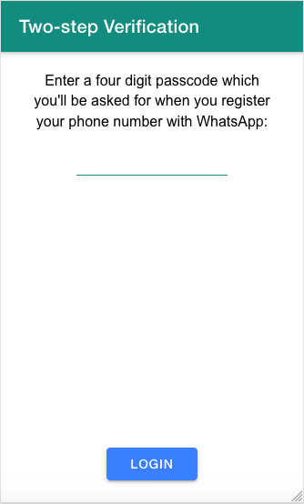
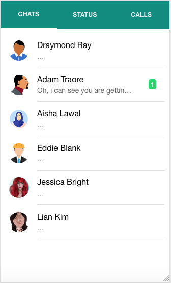
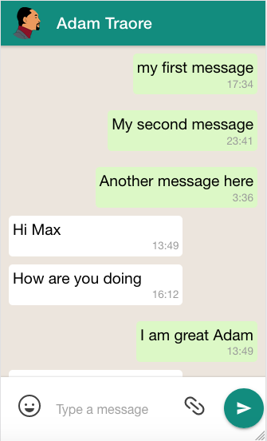
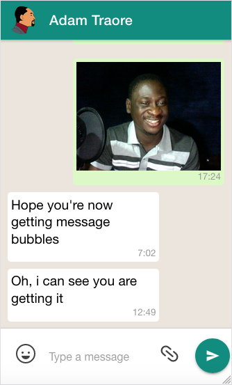

# WhatsApp Clone with Ionic React

This project was created for the course [Learn Ionic React By Building a WhatsApp Clone](https://www.udemy.com/ionic-react-whatsapp-clone) on Udemy that details the step by step process for building this clone.

## Running the Project

- Create a Firebase account
- Create two collections `messages` and `users` in Cloud Firestore
- Seed your `users` collection the [firebase-seeder](https://github.com/coderonfleek/firebase-seeder) code
- Replace the credentials in `src/Config.js`
- Run `ionic serve`

## Project Screenshots

